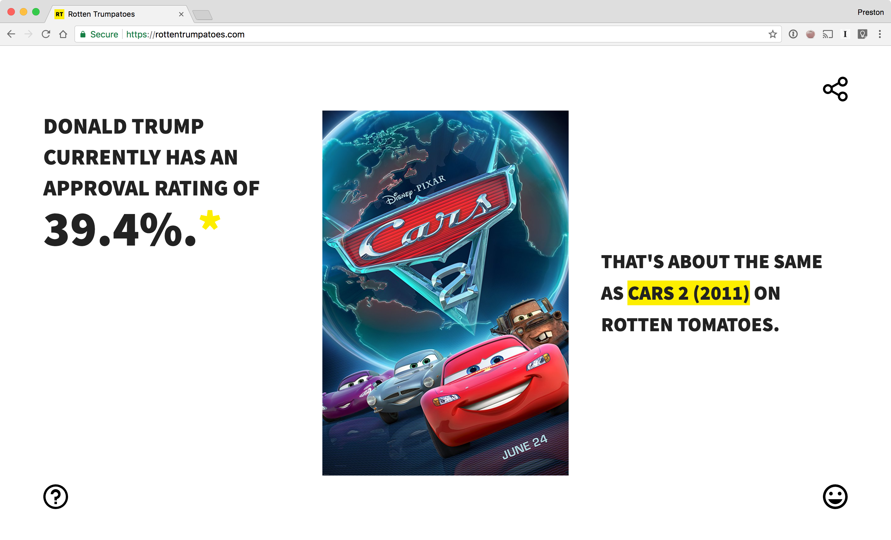

# [Rotten Trumpatoes](https://rottentrumpatoes.com/)

A stupid project inspired by [a tweet](https://twitter.com/PJVogt/status/895824447113842689).



---

## How
Every hour, scrape [FiveThirtyEight](https://projects.fivethirtyeight.com/trump-approval-ratings/) (using [puppeteer](https://github.com/GoogleChrome/puppeteer)) to get Trump's approval rating. On request, return a random movie from a DB (er, [JSON file](https://github.com/prichey/rottentrumpatoes/blob/master/movies.json)) with the same rating on Rotten Tomatoes as the approval rating.

The DB was created by scraping 150 pages of the [TMDb](https://www.themoviedb.org/documentation/api) [/discover](https://www.themoviedb.org/documentation/api/discover) endpoint, pulling in additional information (Rotten Tomatoes score and poster url) from [OMDB](http://www.omdbapi.com/), then searching Rotten Tomatoes (literally by scraping [https://www.rottentomatoes.com/search/?search=MOVIE_TITLE](https://www.rottentomatoes.com/search/?search=MOVIE_TITLE), again with puppeteer) and parsing the results to find the Rotten Tomatoes url. I had to introduce a delay ([here](https://github.com/prichey/rottentrumpatoes/blob/master/lib/movie.js#L67)) because I think somebody found out what I was doing and started throttling my requests.

## Why
¯\\_(ツ)_/¯

---

## Deployment
[Mostly for my own reference, I have no idea why you would want to do this.]

#### Dokku
Rotten Trumpatoes is set up to be deployed via [dokku](https://github.com/dokku/dokku) (which I love very much). Puppeteer relies on [dependencies](https://github.com/GoogleChrome/puppeteer/blob/master/docs/troubleshooting.md#chrome-headless-doesnt-launch) that aren't in the default docker container so you'll need to install the [dokku-apt](https://github.com/F4-Group/dokku-apt) plugin (which automatically pulls from [apt-packages](https://github.com/prichey/rottentrumpatoes/blob/master/apt-packages)). I stole this approach from [dokku-puppeteer-example](https://github.com/mskog/dokku-puppeteer-example).

#### process.env
I use [dotenv](https://github.com/motdotla/dotenv), which relies on a `.env` at the root of the project. Because this file isn't version controlled, you'll have to set the environment variables on dokku as well ([like so](http://dokku.viewdocs.io/dokku/configuration/environment-variables/)). For local development, add a `.env` with the following:
```
MOVIEDB_API_KEY=foo
OMDB_API_KEY=bar
FB_APP_SECRET=baz
FB_APP_ID=qux
```
Instructions to get a MovieDB API key are [here](https://developers.themoviedb.org/3/getting-started/authentication) and you can get an OMDB API key [here](http://www.omdbapi.com/apikey.aspx). The `FB_APP_SECRET` and `FB_APP_ID` aren't technically necessary, but 1. Facebook Open Graph debugger complains if you don't include the app ID in the meta, and 2. I attempt to force Facebook to rescrape the OG data every time I update the approval rating (like [this](https://github.com/prichey/rottentrumpatoes/blob/master/lib/fb.js#L25-L38) as per [this](https://stackoverflow.com/a/12101700/2777986)). I'm not even sure it works reliably, but it doesn't fail so for the moment I'm leaving it in.
